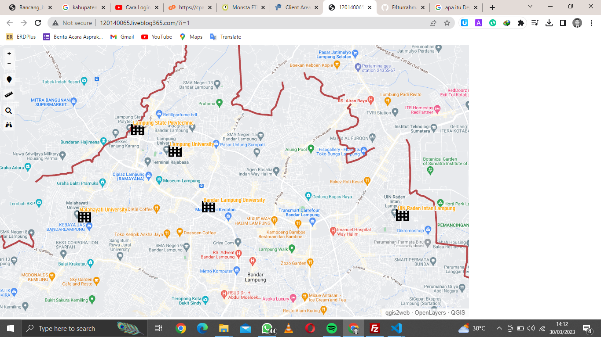

# UTS-SIG (Peta Administratif - Kampus di Bandar Lampung)

## Author

Nama    : Muhammad Duta Faturrahman
NIM     : 120140065

### Description

"Peta Administratif - Kampus di Bandar Lampung" adalah sebuah website yang menampilkan peta sebagai penunjuk jumlah kampus yang terdapat di Kabupaten Bandar Lampung.

### Dependencies

- QGis
- PHP
- Pro Free Host

### How to run this web

1. Visit the Domain

```bash
http://120140065.liveblog365.com/?i=1
```

2. Silahkan perbesar gambar peta untuk mendapatkan gambar ikon kampus.

## Screenshoot

- Halaman Web
  
